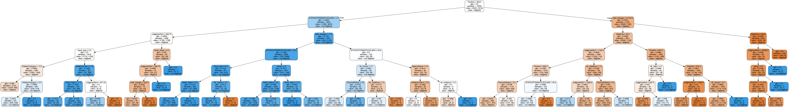

# Detroit study
## Determine blighted buildings in the city

In this project, our goal is to build a model able to determine if a building will be consider as blighted, based on his events history.

We know the history of a tons of locations in Detroit and also an history of blighted buildings.
As extra resources, we will use the list of 311 calls, crime history and violations.


```python
import pandas as pd
import numpy as np
from datetime import datetime
```

## Determine buildings in the city

In this part, we've to determine a list of all he buildings in the city.
To perform that, we use all the resources we own and build clusters of events to determine an exhaustive list of buildings in the city.


### Data grouping for location detection


```python
data = pd.read_csv('detroit-311.csv')
data2 = pd.read_csv('detroit-blight-violations.csv')
data3 = pd.read_csv('detroit-crime.csv')
data4 = pd.read_csv('detroit-demolition-permits.tsv', sep='\t')
```


```python
locationsData3 = pd.concat([data3['LAT'], data3['LON']], axis=1)
locationsData3.columns = ['lat', 'lng']

locationsData2 = pd.DataFrame(columns={'lat', 'lng'})
def parseAddress(dirtyAddress):
    try:
        addressData = dirtyAddress.split('\n')
        lat = addressData[2][1:-1].split(',')[0].strip()
        lng = addressData[2][1:-1].split(',')[1].strip()
        return pd.Series([lat, lng])
    except:
        pass

locationsData2A = data2.apply(lambda row:parseAddress(row['ViolationAddress']),axis=1)
locationsData2B = data2.apply(lambda row:parseAddress(row['MailingAddress']),axis=1)
locationsData2A.columns = ['lat', 'lng']
locationsData2B.columns = ['lat', 'lng']


locationsData4A = data4.apply(lambda row:parseAddress(row['site_location']),axis=1)
locationsData4B = data4.apply(lambda row:parseAddress(row['owner_location']),axis=1)
locationsData4C = data4.apply(lambda row:parseAddress(row['contractor_location']),axis=1)
locationsData4A.columns = ['lat', 'lng']
locationsData4B.columns = ['lat', 'lng']
locationsData4C.columns = ['lat', 'lng']

locationsData =  pd.concat([data['lat'], data['lng']], axis=1)
```


```python
locations = pd.DataFrame(columns={'lat', 'lng'})
locations = locations.append(locationsData, ignore_index=True)
locations = locations.append(locationsData2A, ignore_index=True)
locations = locations.append(locationsData2B, ignore_index=True)
locations = locations.append(locationsData3, ignore_index=True)
locations = locations.append(locationsData4A, ignore_index=True)
locations = locations.append(locationsData4B, ignore_index=True)
locations = locations.append(locationsData4C, ignore_index=True)
```


```python
locations.count()
```


    lat    770942
    lng    770942
    dtype: int64


```python
locations['lat'] = pd.to_numeric(locations['lat'], errors='raise') 
locations['lng'] = pd.to_numeric(locations['lng'], errors='raise') 
locations.to_csv('./locations.csv', index=False)
```

#### We now have a complete list of uniques lat/lng of locations in the city and around.


```python
locations = pd.read_csv('./locations.csv')
```

### Format and clean data


```python
locations['lat'] = locations.apply(lambda row:np.round(row['lat'], 5),axis=1)
locations['lng'] = locations.apply(lambda row:np.round(row['lng'], 5),axis=1)
```


```python
locations = locations.drop_duplicates()
```


```python
locations = locations[(locations['lat'] > 23) & (locations['lat'] < 50)]
locations['lat'].describe()
```


    count    264401.000000
    mean         42.259709
    std           1.149134
    min          24.550520
    25%          42.359050
    50%          42.393900
    75%          42.423900
    max          48.792170
    Name: lat, dtype: float64


```python
locations = locations[(locations['lng'] < -64) & (locations['lng'] > -132)]
locations['lng'].describe()
```


    count    264399.000000
    mean        -83.392738
    std           3.151343
    min        -124.174110
    25%         -83.200370
    50%         -83.127700
    75%         -83.032930
    max         -69.298540
    Name: lng, dtype: float64


```python
locations = locations.reset_index()
```

### Run DBScan to discover right locations

We use DBScan algorithm to create clusters of buildings based on locations.
We discovered  ~ 200K locations over ~ 800K sparsed locations


```python
from sklearn.cluster import DBSCAN
from sklearn import metrics
from sklearn.datasets.samples_generator import make_blobs
from sklearn.preprocessing import StandardScaler
```


```python
test_data = locations
X = pd.concat([test_data['lat'], test_data['lng']], axis=1).as_matrix()
```


```python
# Compute DBSCAN
db = DBSCAN(eps=0.0001, min_samples=1).fit(X)
core_samples_mask = np.zeros_like(db.labels_, dtype=bool)
core_samples_mask[db.core_sample_indices_] = True
labels = db.labels_
```


```python
# Number of clusters in labels, ignoring noise if present.
n_clusters_ = len(set(labels)) - (1 if -1 in labels else 0)
print('Estimated number of clusters: %d' % n_clusters_)
```

    Estimated number of clusters: 200969


### Populate blocs ids


```python
def populateBlocs(row):
    #print row.name, labels[(row.name)], (row.name)
    try:
        return labels[(row.name)]
    except:
        pass

locations['bloc_id'] = locations.apply(populateBlocs, axis=1)
```


```python
locations = locations.drop('index', axis=1)
```


```python
locations.to_csv('./locations_buildings',index=False)
```


```python
locations.count()
```


    lat        264399
    lng        264399
    bloc_id    264399
    dtype: int64


### Regroup locations and blocs

Based on the locations, we define buildings with a local search around them.


```python
# precision +0.00009999999, -0.00009999999
```


```python
groupedLocations = locations.groupby('bloc_id', as_index=False)
latitudes = groupedLocations['lat'].describe()
longitudes = groupedLocations['lng'].describe()
```


```python
latitudes = latitudes.rename(columns = {
        'mean': 'lat_mean',
        'min': 'lat_min',
        'max': 'lat_max',
    })
```


```python
longitudes = longitudes.rename(columns = {
        'mean': 'lng_mean',
        'min': 'lng_min',
        'max': 'lng_max',
    })
```


```python
mergedCoordinates = pd.concat([latitudes, longitudes], axis=1)

def getBlocBoxes(row):
    return pd.Series([
            row.name, 
            row['lat_mean'], 
            row['lng_mean'], 
            row['lat_min'], 
            row['lat_max'], 
            row['lng_min'], 
            row['lng_max'] 
        ])
    
coordinates = mergedCoordinates.apply(getBlocBoxes, axis=1)
coordinates.columns = ['bloc_id', 'lat_center', 'lng_center', 'lat_min', 'lat_max', 'lng_min', 'lng_max']
coordinates.head()
```


<div>
<table border="1" class="dataframe">
  <thead>
    <tr style="text-align: right;">
      <th></th>
      <th>bloc_id</th>
      <th>lat_center</th>
      <th>lng_center</th>
      <th>lat_min</th>
      <th>lat_max</th>
      <th>lng_min</th>
      <th>lng_max</th>
    </tr>
  </thead>
  <tbody>
    <tr>
      <th>0</th>
      <td>0.0</td>
      <td>42.384017</td>
      <td>-83.161034</td>
      <td>42.38388</td>
      <td>42.38415</td>
      <td>-83.16107</td>
      <td>-83.16095</td>
    </tr>
    <tr>
      <th>1</th>
      <td>1.0</td>
      <td>42.440470</td>
      <td>-83.080920</td>
      <td>42.44047</td>
      <td>42.44047</td>
      <td>-83.08092</td>
      <td>-83.08092</td>
    </tr>
    <tr>
      <th>2</th>
      <td>2.0</td>
      <td>42.445240</td>
      <td>-82.962040</td>
      <td>42.44524</td>
      <td>42.44524</td>
      <td>-82.96204</td>
      <td>-82.96204</td>
    </tr>
    <tr>
      <th>3</th>
      <td>3.0</td>
      <td>42.421037</td>
      <td>-83.166245</td>
      <td>42.42100</td>
      <td>42.42106</td>
      <td>-83.16630</td>
      <td>-83.16619</td>
    </tr>
    <tr>
      <th>4</th>
      <td>4.0</td>
      <td>42.402030</td>
      <td>-83.162870</td>
      <td>42.40203</td>
      <td>42.40203</td>
      <td>-83.16287</td>
      <td>-83.16287</td>
    </tr>
  </tbody>
</table>
</div>


As you see above, a building is now define by a center and four delimitation points.


```python
coordinates.count()
```


    bloc_id       200969
    lat_center    200969
    lng_center    200969
    lat_min       200969
    lat_max       200969
    lng_min       200969
    lng_max       200969
    dtype: int64


```python
coordinates.to_csv('./blocs.csv', index=False)
```


```python
coordinates = pd.read_csv('./blocs.csv')
```

### Test the bloc finder from lat/lng

We define a function to retrieve a list of blocs from coordinates.


```python
def getBlocs(x, y):
    go = True
    precision = 1e-08
    while (go or len(coords) < 1):
        
        coords = coordinates[
            (np.isclose(coordinates['lat_center'], x, rtol=precision, atol=1e-05)) &
            (np.isclose(coordinates['lng_center'],y, rtol=precision, atol=1e-05))
        ]
        
        precision *= 10
        if precision >= 1e-04:
            break

        go = False
    
    precision = 1e-08
    while (len(coords) < 1):
        
        coords = coordinates[
            (np.isclose(coordinates['lat_min'], x, rtol=precision, atol=1e-05)) &
            (np.isclose(coordinates['lat_max'],x, rtol=precision, atol=1e-05)) &
            (np.isclose(coordinates['lng_min'], y, rtol=precision, atol=1e-05)) &
            (np.isclose(coordinates['lng_max'],y, rtol=precision, atol=1e-05))
        ]
        
        precision *= 10
        if precision >= 1e-04:
            return 0

    return list(set(coords['bloc_id']))[0]
```

#### Testing


```python
results = getBlocs(42.440, -83.08)
print results
```

    set([41024.0, 187488.0, 45378.0, 43783.0, 75101.0, 150512.0, 135985.0, 191985.0, 60379.0, 35677.0, 40959.0])


## Study demolition permits

We extract a list of blighted building from the demolition permits list.
Then, we will define an equivalent list of non blighted buildings.
That will be our base for a training dataset.


```python
permits = pd.read_csv('detroit-demolition-permits.tsv', sep='\t')
```


```python
permits['BLD_PERMIT_TYPE'].value_counts()
```


    DISM         5859
    Dismantle    1274
    Name: BLD_PERMIT_TYPE, dtype: int64


```python
def parseAddress(dirtyAddress):
    try:
        addressData = dirtyAddress.split('\n')
        lat = addressData[2][1:-1].split(',')[0].strip()
        lng = addressData[2][1:-1].split(',')[1].strip()
        return pd.Series([lat, lng])
    except:
        return pd.Series([0, 0])


```


```python
blightedPlaces = permits.apply(lambda row:parseAddress(row['site_location']),axis=1)
blightedPlaces.columns = ['lat', 'lng']
```


```python
blightedPlaces = blightedPlaces[(blightedPlaces['lat'] > 0) & (blightedPlaces['lng'] > 0)]
blightedPlaces.count()
```


    lat    6275
    lng    6275
    dtype: int64


```python
blightedPlaces['lat'] = pd.to_numeric(blightedPlaces['lat'], errors='raise') 
blightedPlaces['lng'] = pd.to_numeric(blightedPlaces['lng'], errors='raise') 
```


```python
coordinates.head()
```


<div>
<table border="1" class="dataframe">
  <thead>
    <tr style="text-align: right;">
      <th></th>
      <th>bloc_id</th>
      <th>lat_center</th>
      <th>lng_center</th>
      <th>lat_min</th>
      <th>lat_max</th>
      <th>lng_min</th>
      <th>lng_max</th>
    </tr>
  </thead>
  <tbody>
    <tr>
      <th>0</th>
      <td>0.0</td>
      <td>42.384017</td>
      <td>-83.161034</td>
      <td>42.38388</td>
      <td>42.38415</td>
      <td>-83.16107</td>
      <td>-83.16095</td>
    </tr>
    <tr>
      <th>1</th>
      <td>1.0</td>
      <td>42.440470</td>
      <td>-83.080920</td>
      <td>42.44047</td>
      <td>42.44047</td>
      <td>-83.08092</td>
      <td>-83.08092</td>
    </tr>
    <tr>
      <th>2</th>
      <td>2.0</td>
      <td>42.445240</td>
      <td>-82.962040</td>
      <td>42.44524</td>
      <td>42.44524</td>
      <td>-82.96204</td>
      <td>-82.96204</td>
    </tr>
    <tr>
      <th>3</th>
      <td>3.0</td>
      <td>42.421037</td>
      <td>-83.166245</td>
      <td>42.42100</td>
      <td>42.42106</td>
      <td>-83.16630</td>
      <td>-83.16619</td>
    </tr>
    <tr>
      <th>4</th>
      <td>4.0</td>
      <td>42.402030</td>
      <td>-83.162870</td>
      <td>42.40203</td>
      <td>42.40203</td>
      <td>-83.16287</td>
      <td>-83.16287</td>
    </tr>
  </tbody>
</table>
</div>


### Retrieve blocs for all places


```python
blightedPlaces['bloc_id'] = blightedPlaces.apply(lambda row: getBlocs(row['lat'], row['lng']), axis=1)
```


```python
diff = coordinates[~coordinates.bloc_id.isin(blightedPlaces['bloc_id'])]
```


```python
notBlightedPlaces = diff.sample(len(blightedPlaces.index))
```


```python
notBlightedPlaces.count()
```


    bloc_id    6275
    label      6275
    dtype: int64


### Setup dataset for ML training


```python
training = pd.concat([blightedPlaces['bloc_id']], axis=1)
training['label'] = 'blighted'
```


```python
notBlightedPlaces = pd.concat([notBlightedPlaces['bloc_id']], axis=1)
notBlightedPlaces['label'] = 'notblighted'
```


```python
training = training.append(notBlightedPlaces, ignore_index=True)
```


```python
training.count()
```


    bloc_id    12550
    label      12550
    dtype: int64


```python
training.to_csv('./training2.csv', index=False)
```


```python
training = pd.read_csv('training2.csv')
```

## First checkpoint in the project

We now have a reasonable sized dataset of building from the city of Detroit;
Our goal is know to enrich it with enough features to be relevant for training.

## Study blight violations


```python
violations = pd.read_csv('detroit-blight-violations.csv')
```


```python
violations.head()
```


<div>
<table border="1" class="dataframe">
  <thead>
    <tr style="text-align: right;">
      <th></th>
      <th>TicketID</th>
      <th>TicketNumber</th>
      <th>AgencyName</th>
      <th>ViolName</th>
      <th>ViolationStreetNumber</th>
      <th>ViolationStreetName</th>
      <th>MailingStreetNumber</th>
      <th>MailingStreetName</th>
      <th>MailingCity</th>
      <th>MailingState</th>
      <th>MailingZipCode</th>
      <th>NonUsAddressCode</th>
      <th>Country</th>
      <th>TicketIssuedDT</th>
      <th>TicketIssuedTime</th>
      <th>HearingDT</th>
      <th>CourtTime</th>
      <th>ViolationCode</th>
      <th>ViolDescription</th>
      <th>Disposition</th>
      <th>FineAmt</th>
      <th>AdminFee</th>
      <th>LateFee</th>
      <th>StateFee</th>
      <th>CleanUpCost</th>
      <th>JudgmentAmt</th>
      <th>PaymentStatus</th>
      <th>Void</th>
      <th>ViolationCategory</th>
      <th>ViolationAddress</th>
      <th>MailingAddress</th>
    </tr>
  </thead>
  <tbody>
    <tr>
      <th>0</th>
      <td>26288</td>
      <td>05000001DAH</td>
      <td>Department of Public Works</td>
      <td>Group, LLC, Grand Holding</td>
      <td>2566</td>
      <td>GRAND BLVD</td>
      <td>743</td>
      <td>Beaubien, Ste. 201</td>
      <td>Detroit</td>
      <td>MI</td>
      <td>48226</td>
      <td>NaN</td>
      <td>NaN</td>
      <td>01/01/38440 12:00:00 AM</td>
      <td>12:00:00</td>
      <td>01/01/38474 12:00:00 AM</td>
      <td>9:00AM</td>
      <td>22-2-20</td>
      <td>Burning solid waste  in open fires</td>
      <td>Responsible By Determination</td>
      <td>$1500.00</td>
      <td>$20.00</td>
      <td>$150.00</td>
      <td>$10.00</td>
      <td>$0.00</td>
      <td>$1680.00</td>
      <td>PAID IN FULL</td>
      <td>0.0</td>
      <td>0</td>
      <td>2566 GRAND BLVD\nDetroit, MI\n(42.363182370000...</td>
      <td>743 Beaubien\nDetroit, MI 48226\n(42.333730630...</td>
    </tr>
    <tr>
      <th>1</th>
      <td>19800</td>
      <td>05000025DAH</td>
      <td>Department of Public Works</td>
      <td>JACKSON, RAECHELLE</td>
      <td>19014</td>
      <td>ASHTON</td>
      <td>20501</td>
      <td>HEYDEN</td>
      <td>DETROIT</td>
      <td>MI</td>
      <td>48219</td>
      <td>NaN</td>
      <td>NaN</td>
      <td>01/01/38383 12:00:00 AM</td>
      <td>10:15:00</td>
      <td>01/01/38425 12:00:00 AM</td>
      <td>1:30PM</td>
      <td>22-2-22</td>
      <td>Bulk solid waste deposited more than 24 hours ...</td>
      <td>Not responsible By Determination</td>
      <td>$100.00</td>
      <td>$20.00</td>
      <td>$10.00</td>
      <td>$10.00</td>
      <td>$0.00</td>
      <td>$140.00</td>
      <td>NO PAYMENT APPLIED</td>
      <td>0.0</td>
      <td>0</td>
      <td>19014 ASHTON\nDetroit, MI\n(42.429390762000025...</td>
      <td>20501 HEYDEN\nDETROIT, MI 48219\n(42.442177633...</td>
    </tr>
    <tr>
      <th>2</th>
      <td>19804</td>
      <td>05000026DAH</td>
      <td>Department of Public Works</td>
      <td>TALTON, CAROL ANN</td>
      <td>18735</td>
      <td>STAHELIN</td>
      <td>18735</td>
      <td>STAHELI N</td>
      <td>DETROIT</td>
      <td>MI</td>
      <td>48219</td>
      <td>NaN</td>
      <td>NaN</td>
      <td>01/01/38383 12:00:00 AM</td>
      <td>10:35:00</td>
      <td>01/01/38425 12:00:00 AM</td>
      <td>1:30PM</td>
      <td>22-2-22</td>
      <td>Bulk solid waste deposited more than 24 hours ...</td>
      <td>Responsible By Determination</td>
      <td>$100.00</td>
      <td>$20.00</td>
      <td>$10.00</td>
      <td>$10.00</td>
      <td>$0.00</td>
      <td>$140.00</td>
      <td>PAID IN FULL</td>
      <td>0.0</td>
      <td>0</td>
      <td>18735 STAHELIN\nDetroit, MI\n(42.4287074590000...</td>
      <td>18735 STAHELI N\nDETROIT, MI 48219\n(42.428707...</td>
    </tr>
    <tr>
      <th>3</th>
      <td>20208</td>
      <td>05000027DAH</td>
      <td>Department of Public Works</td>
      <td>BONNER, DARRYL E.</td>
      <td>20125</td>
      <td>MONICA</td>
      <td>25335</td>
      <td>PEEKSKILL</td>
      <td>SOUTHFIELD</td>
      <td>MI</td>
      <td>48043</td>
      <td>NaN</td>
      <td>NaN</td>
      <td>01/01/38385 12:00:00 AM</td>
      <td>10:45:00</td>
      <td>01/01/38422 12:00:00 AM</td>
      <td>1:30PM</td>
      <td>22-2-45</td>
      <td>Violation of time limit for approved container...</td>
      <td>Responsible By Default</td>
      <td>$100.00</td>
      <td>$20.00</td>
      <td>$10.00</td>
      <td>$10.00</td>
      <td>$0.00</td>
      <td>$140.00</td>
      <td>NO PAYMENT APPLIED</td>
      <td>0.0</td>
      <td>0</td>
      <td>20125 MONICA\nDetroit, MI\n(42.44169828400004,...</td>
      <td>25335 PEEKSKILL\nSOUTHFIELD, MI 48043\n(42.475...</td>
    </tr>
    <tr>
      <th>4</th>
      <td>20211</td>
      <td>05000028DAH</td>
      <td>Department of Public Works</td>
      <td>GREGORY, JAMES LEE</td>
      <td>17397</td>
      <td>PRAIRIE</td>
      <td>17397</td>
      <td>PRAIRIE</td>
      <td>DETROIT</td>
      <td>MI</td>
      <td>48221</td>
      <td>NaN</td>
      <td>NaN</td>
      <td>01/01/38385 12:00:00 AM</td>
      <td>11:10:00</td>
      <td>01/01/38422 12:00:00 AM</td>
      <td>1:30PM</td>
      <td>22-2-22</td>
      <td>Bulk solid waste deposited more than 24 hours ...</td>
      <td>Responsible By Default</td>
      <td>$100.00</td>
      <td>$20.00</td>
      <td>$10.00</td>
      <td>$10.00</td>
      <td>$0.00</td>
      <td>$140.00</td>
      <td>PAID IN FULL</td>
      <td>0.0</td>
      <td>0</td>
      <td>17397 PRAIRIE\nDetroit, MI\n(42.42031769500005...</td>
      <td>17397 PRAIRIE\nDETROIT, MI 48221\n(42.42031769...</td>
    </tr>
  </tbody>
</table>
</div>


### Analysis results

After some graphs and study, we concluded that we've a lot of useful informations in this document.
We selected some of them. Costs related data of a violation seems to be the most interesting stuf here.
By the way , we'll try to extract more data around the payment status which could be consider as a good factor for a blighted building and maybe also the violation category (0 or 1 mainly)


```python
cleandedViolations = pd.concat([violations['AgencyName'], violations['ViolationCode'], violations['FineAmt']
                                , violations['StateFee'], violations['CleanUpCost'], violations['JudgmentAmt']
                                ,violations['PaymentStatus'], violations['ViolationCategory'], violations['ViolationAddress']]
                               , axis=1)
```


```python
cleandedViolations.head()
```


<div>
<table border="1" class="dataframe">
  <thead>
    <tr style="text-align: right;">
      <th></th>
      <th>AgencyName</th>
      <th>ViolationCode</th>
      <th>FineAmt</th>
      <th>StateFee</th>
      <th>CleanUpCost</th>
      <th>JudgmentAmt</th>
      <th>PaymentStatus</th>
      <th>ViolationCategory</th>
      <th>ViolationAddress</th>
    </tr>
  </thead>
  <tbody>
    <tr>
      <th>0</th>
      <td>Department of Public Works</td>
      <td>22-2-20</td>
      <td>$1500.00</td>
      <td>$10.00</td>
      <td>$0.00</td>
      <td>$1680.00</td>
      <td>PAID IN FULL</td>
      <td>0</td>
      <td>2566 GRAND BLVD\nDetroit, MI\n(42.363182370000...</td>
    </tr>
    <tr>
      <th>1</th>
      <td>Department of Public Works</td>
      <td>22-2-22</td>
      <td>$100.00</td>
      <td>$10.00</td>
      <td>$0.00</td>
      <td>$140.00</td>
      <td>NO PAYMENT APPLIED</td>
      <td>0</td>
      <td>19014 ASHTON\nDetroit, MI\n(42.429390762000025...</td>
    </tr>
    <tr>
      <th>2</th>
      <td>Department of Public Works</td>
      <td>22-2-22</td>
      <td>$100.00</td>
      <td>$10.00</td>
      <td>$0.00</td>
      <td>$140.00</td>
      <td>PAID IN FULL</td>
      <td>0</td>
      <td>18735 STAHELIN\nDetroit, MI\n(42.4287074590000...</td>
    </tr>
    <tr>
      <th>3</th>
      <td>Department of Public Works</td>
      <td>22-2-45</td>
      <td>$100.00</td>
      <td>$10.00</td>
      <td>$0.00</td>
      <td>$140.00</td>
      <td>NO PAYMENT APPLIED</td>
      <td>0</td>
      <td>20125 MONICA\nDetroit, MI\n(42.44169828400004,...</td>
    </tr>
    <tr>
      <th>4</th>
      <td>Department of Public Works</td>
      <td>22-2-22</td>
      <td>$100.00</td>
      <td>$10.00</td>
      <td>$0.00</td>
      <td>$140.00</td>
      <td>PAID IN FULL</td>
      <td>0</td>
      <td>17397 PRAIRIE\nDetroit, MI\n(42.42031769500005...</td>
    </tr>
  </tbody>
</table>
</div>


#### We've to convert all the currency data into float to be able to handle it.


```python
def toDollar(dollar):
    try:
        return float(dollar[1:])
    except:
        return 0

cleandedViolations['StateFee'] = cleandedViolations.apply(lambda row: toDollar(row['StateFee']), axis=1)
cleandedViolations['CleanUpCost'] = cleandedViolations.apply(lambda row: toDollar(row['CleanUpCost']), axis=1)
cleandedViolations['JudgmentAmt'] = cleandedViolations.apply(lambda row: toDollar(row['JudgmentAmt']), axis=1)
cleandedViolations['FineAmt'] = cleandedViolations.apply(lambda row: toDollar(row['FineAmt']), axis=1)
cleandedViolations.head()
```


<div>
<table border="1" class="dataframe">
  <thead>
    <tr style="text-align: right;">
      <th></th>
      <th>AgencyName</th>
      <th>ViolationCode</th>
      <th>FineAmt</th>
      <th>StateFee</th>
      <th>CleanUpCost</th>
      <th>JudgmentAmt</th>
      <th>PaymentStatus</th>
      <th>ViolationCategory</th>
      <th>ViolationAddress</th>
    </tr>
  </thead>
  <tbody>
    <tr>
      <th>0</th>
      <td>Department of Public Works</td>
      <td>22-2-20</td>
      <td>1500.0</td>
      <td>10.0</td>
      <td>0.0</td>
      <td>1680.0</td>
      <td>PAID IN FULL</td>
      <td>0</td>
      <td>2566 GRAND BLVD\nDetroit, MI\n(42.363182370000...</td>
    </tr>
    <tr>
      <th>1</th>
      <td>Department of Public Works</td>
      <td>22-2-22</td>
      <td>100.0</td>
      <td>10.0</td>
      <td>0.0</td>
      <td>140.0</td>
      <td>NO PAYMENT APPLIED</td>
      <td>0</td>
      <td>19014 ASHTON\nDetroit, MI\n(42.429390762000025...</td>
    </tr>
    <tr>
      <th>2</th>
      <td>Department of Public Works</td>
      <td>22-2-22</td>
      <td>100.0</td>
      <td>10.0</td>
      <td>0.0</td>
      <td>140.0</td>
      <td>PAID IN FULL</td>
      <td>0</td>
      <td>18735 STAHELIN\nDetroit, MI\n(42.4287074590000...</td>
    </tr>
    <tr>
      <th>3</th>
      <td>Department of Public Works</td>
      <td>22-2-45</td>
      <td>100.0</td>
      <td>10.0</td>
      <td>0.0</td>
      <td>140.0</td>
      <td>NO PAYMENT APPLIED</td>
      <td>0</td>
      <td>20125 MONICA\nDetroit, MI\n(42.44169828400004,...</td>
    </tr>
    <tr>
      <th>4</th>
      <td>Department of Public Works</td>
      <td>22-2-22</td>
      <td>100.0</td>
      <td>10.0</td>
      <td>0.0</td>
      <td>140.0</td>
      <td>PAID IN FULL</td>
      <td>0</td>
      <td>17397 PRAIRIE\nDetroit, MI\n(42.42031769500005...</td>
    </tr>
  </tbody>
</table>
</div>


```python
cleandedViolations.to_csv('./cleandedViolations.csv', index=False)
```

#### As usual, we parsed addresses to find locations, then, associated buildings (from our first location dataset)


```python
violationsCoords = cleandedViolations.apply(lambda row:parseAddress(row['ViolationAddress']),axis=1)
```


```python
violationsCoords.columns = ['lat', 'lng']
```


```python
violationsCoords['lat'] = pd.to_numeric(violationsCoords['lat'], errors='raise') 
violationsCoords['lng'] = pd.to_numeric(violationsCoords['lng'], errors='raise') 
violationsCoords['lat'] = violationsCoords.apply(lambda row:np.round(row['lat'], 5),axis=1)
violationsCoords['lng'] = violationsCoords.apply(lambda row:np.round(row['lng'], 5),axis=1)
```


```python
coordinates = pd.read_csv('blocs.csv')
```


```python
violationsCoords.count()
```


    lat    307804
    lng    307804
    dtype: int64


```python
#testData = violationsCoords[50:100]
violations['bloc_id'] = violations.apply(lambda row: getBlocs(row['lat'], row['lng']), axis=1)
```


```python
violations = pd.concat([cleandedViolations, violationsCoords], axis=1)
```

#### As an extra feature, we would like to keep a part of the violation code for each violation. Maybe we've some more important than others; classify them could have an interest.


```python
def getViolationsCodeDetails(violationCode):
    details = violationCode.split('-')
    
    data = {}
    if len(details) > 0 and details[0] is not None:
        data['violationCode-0'] = details[0]
        
    if len(details) > 1 and details[1] is not None:
        data['violationCode-1'] = details[1]
    if len(details) > 2 and details[2] is not None:
        data['violationCode-2'] = details[2]
    
    if len(data) > 0:
        return pd.Series(data)
    else:
        print details
        pass
    

violations = violations.merge(violations.ViolationCode.apply(lambda row: getViolationsCodeDetails(row)), 
    left_index=True, right_index=True)

violations.head()
```


<div>
<table border="1" class="dataframe">
  <thead>
    <tr style="text-align: right;">
      <th></th>
      <th>AgencyName</th>
      <th>ViolationCode</th>
      <th>FineAmt</th>
      <th>StateFee</th>
      <th>CleanUpCost</th>
      <th>JudgmentAmt</th>
      <th>PaymentStatus</th>
      <th>ViolationCategory</th>
      <th>ViolationAddress</th>
      <th>lat</th>
      <th>lng</th>
      <th>violationCode-0</th>
      <th>violationCode-1</th>
      <th>violationCode-2</th>
    </tr>
  </thead>
  <tbody>
    <tr>
      <th>0</th>
      <td>Department of Public Works</td>
      <td>22-2-20</td>
      <td>1500.0</td>
      <td>10.0</td>
      <td>0.0</td>
      <td>1680.0</td>
      <td>PAID IN FULL</td>
      <td>0</td>
      <td>2566 GRAND BLVD\nDetroit, MI\n(42.363182370000...</td>
      <td>42.363182</td>
      <td>-83.091677</td>
      <td>22</td>
      <td>2</td>
      <td>20</td>
    </tr>
    <tr>
      <th>1</th>
      <td>Department of Public Works</td>
      <td>22-2-22</td>
      <td>100.0</td>
      <td>10.0</td>
      <td>0.0</td>
      <td>140.0</td>
      <td>NO PAYMENT APPLIED</td>
      <td>0</td>
      <td>19014 ASHTON\nDetroit, MI\n(42.429390762000025...</td>
      <td>42.429391</td>
      <td>-83.220394</td>
      <td>22</td>
      <td>2</td>
      <td>22</td>
    </tr>
    <tr>
      <th>2</th>
      <td>Department of Public Works</td>
      <td>22-2-22</td>
      <td>100.0</td>
      <td>10.0</td>
      <td>0.0</td>
      <td>140.0</td>
      <td>PAID IN FULL</td>
      <td>0</td>
      <td>18735 STAHELIN\nDetroit, MI\n(42.4287074590000...</td>
      <td>42.428707</td>
      <td>-83.227548</td>
      <td>22</td>
      <td>2</td>
      <td>22</td>
    </tr>
    <tr>
      <th>3</th>
      <td>Department of Public Works</td>
      <td>22-2-45</td>
      <td>100.0</td>
      <td>10.0</td>
      <td>0.0</td>
      <td>140.0</td>
      <td>NO PAYMENT APPLIED</td>
      <td>0</td>
      <td>20125 MONICA\nDetroit, MI\n(42.44169828400004,...</td>
      <td>42.441698</td>
      <td>-83.145018</td>
      <td>22</td>
      <td>2</td>
      <td>45</td>
    </tr>
    <tr>
      <th>4</th>
      <td>Department of Public Works</td>
      <td>22-2-22</td>
      <td>100.0</td>
      <td>10.0</td>
      <td>0.0</td>
      <td>140.0</td>
      <td>PAID IN FULL</td>
      <td>0</td>
      <td>17397 PRAIRIE\nDetroit, MI\n(42.42031769500005...</td>
      <td>42.420318</td>
      <td>-83.145328</td>
      <td>22</td>
      <td>2</td>
      <td>22</td>
    </tr>
  </tbody>
</table>
</div>


### Aggregate data by bloc id


```python
violations = pd.read_csv('./violations_blocs.csv')
```


```python
len(violations['bloc_id'].unique())
```


    71692


#### We keep only the first part of the violation code. Also, we don't need anymore the original one and the location, 'cause we've the building id.


```python
violations = violations.drop('ViolationCode', axis=1)
violations = violations.drop('violationCode-1', axis=1)
violations = violations.drop('violationCode-2', axis=1)
violations = violations.drop('ViolationAddress', axis=1)
```


```python
groupedViolations = violations.groupby('bloc_id', as_index=False)
violations['nb_violations'] = 0
```


```python
violations.to_csv('./violations_blocs.csv', index=False)
```

#### Here we aggregate the data by bloc id and consider to trade of some information which could be hard to manage in a modelisation.


```python
groupedViolationsAgg = groupedViolations.agg({
        'AgencyName': 'first',
        'violationCode-0': 'first',
        'FineAmt': 'sum',
        'StateFee': 'sum',
        'CleanUpCost': 'sum',
        'JudgmentAmt': 'sum',
        'PaymentStatus': 'first',
        'ViolationCategory': 'first',
        'nb_violations': 'count'
    })
```


```python
groupedViolationsAgg.head()
```


<div>
<table border="1" class="dataframe">
  <thead>
    <tr style="text-align: right;">
      <th></th>
      <th>bloc_id</th>
      <th>CleanUpCost</th>
      <th>FineAmt</th>
      <th>nb_violations</th>
      <th>AgencyName</th>
      <th>JudgmentAmt</th>
      <th>StateFee</th>
      <th>violationCode-0</th>
      <th>ViolationCategory</th>
      <th>PaymentStatus</th>
    </tr>
  </thead>
  <tbody>
    <tr>
      <th>0</th>
      <td>0.0</td>
      <td>0.0</td>
      <td>550.0</td>
      <td>2</td>
      <td>Department of Public Works</td>
      <td>665.0</td>
      <td>20.0</td>
      <td>22</td>
      <td>0</td>
      <td>NO PAYMENT APPLIED</td>
    </tr>
    <tr>
      <th>1</th>
      <td>1.0</td>
      <td>0.0</td>
      <td>50.0</td>
      <td>1</td>
      <td>Department of Public Works</td>
      <td>85.0</td>
      <td>10.0</td>
      <td>9</td>
      <td>0</td>
      <td>NO PAYMENT APPLIED</td>
    </tr>
    <tr>
      <th>2</th>
      <td>28.0</td>
      <td>0.0</td>
      <td>200.0</td>
      <td>1</td>
      <td>Department of Public Works</td>
      <td>250.0</td>
      <td>10.0</td>
      <td>22</td>
      <td>0</td>
      <td>NO PAYMENT APPLIED</td>
    </tr>
    <tr>
      <th>3</th>
      <td>32.0</td>
      <td>0.0</td>
      <td>1800.0</td>
      <td>5</td>
      <td>Building and Safety Engineering Department</td>
      <td>2130.0</td>
      <td>50.0</td>
      <td>9</td>
      <td>0</td>
      <td>PAID IN FULL</td>
    </tr>
    <tr>
      <th>4</th>
      <td>37.0</td>
      <td>320.0</td>
      <td>3500.0</td>
      <td>7</td>
      <td>Building and Safety Engineering Department</td>
      <td>4060.0</td>
      <td>70.0</td>
      <td>9</td>
      <td>0</td>
      <td>NO PAYMENT APPLIED</td>
    </tr>
  </tbody>
</table>
</div>


## Adds 311 calls

We simply added the necessary information from 311 calls.
We've already selected only few columns from this document and added the count per building.


```python
calls = pd.read_csv('./311_blocs.csv')
calls['nb_calls'] = 0
```


```python
groupedCalls = calls.groupby('bloc_id', as_index=False)
```


```python
groupedCallsAgg = groupedCalls.agg({
        'issue_type': 'last',
        'rating': 'min',
        'ticket_status': 'last',
        'nb_calls': 'count'
    })
```

## Adds crimes

We simply added the necessary information from crimes registered.
We've already selected only few columns from this document and added the count per building.


```python
crimes = pd.read_csv('./crimes_blocs.csv')
crimes['nb_crimes'] = 0
```


```python
groupedCrimes = crimes.groupby('bloc_id', as_index=False)
```


```python
groupedCrimesAgg = groupedCrimes.agg({
        'STATEOFFENSEFILECLASS': 'last',
        'nb_crimes': 'count'
    })
```

## Merge all data


```python
data = pd.merge(training, groupedViolationsAgg, on='bloc_id', how='left')
#data = data.fillna(0)
```


```python
data.to_csv('./data_train_with_violations.csv', index=False)
```


```python
data = pd.merge(data, groupedCallsAgg, on='bloc_id', how='left')
#data = data.fillna(0)
```


```python
data.to_csv('./data_train_with_violations_and_calls.csv', index=False)
```


```python
data = pd.merge(data, groupedCrimesAgg, on='bloc_id', how='left')
#data = data.fillna(0)
```


```python
data.to_csv('./data_train_with_violations_and_calls_and_crimes.csv', index=False)
```


```python
data = pd.read_csv('./data_train_with_violations_and_calls_and_crimes.csv')
```

### Here we fill all the NA with basics informations (arbitrary selected).
We could have done some ML to determine better informations to feed instead.


```python
data['CleanUpCost'] = data['CleanUpCost'].fillna(0)
data['FineAmt'] = data['FineAmt'].fillna(0)
data['nb_violations'] = data['nb_violations'].fillna(0)
data['nb_calls'] = data['nb_calls'].fillna(0)
data['nb_crimes'] = data['nb_crimes'].fillna(0)
data['AgencyName'] = data['AgencyName'].fillna(-1)
data['JudgmentAmt'] = data['JudgmentAmt'].fillna(0)
data['StateFee'] = data['StateFee'].fillna(0)
data['violationCode-0'] = data['violationCode-0'].fillna(-1)
data['ViolationCategory'] = data['ViolationCategory'].fillna(-1)
data['PaymentStatus'] = data['PaymentStatus'].fillna(-1)
data['STATEOFFENSEFILECLASS'] = data['STATEOFFENSEFILECLASS'].fillna(-1)
data['rating'] = data['rating'].fillna(-1)
data['ticket_status'] = data['ticket_status'].fillna(-1)
data['issue_type'] = data['issue_type'].fillna(-1)
```


```python
data.isnull().sum(axis=1).value_counts()
```


    0    12550
    dtype: int64


```python
data.head(5)
```


<div>
<table border="1" class="dataframe">
  <thead>
    <tr style="text-align: right;">
      <th></th>
      <th>bloc_id</th>
      <th>label</th>
      <th>CleanUpCost</th>
      <th>FineAmt</th>
      <th>nb_violations</th>
      <th>AgencyName</th>
      <th>JudgmentAmt</th>
      <th>StateFee</th>
      <th>violationCode-0</th>
      <th>ViolationCategory</th>
      <th>PaymentStatus</th>
      <th>rating</th>
      <th>nb_calls</th>
      <th>ticket_status</th>
      <th>issue_type</th>
      <th>STATEOFFENSEFILECLASS</th>
      <th>nb_crimes</th>
    </tr>
  </thead>
  <tbody>
    <tr>
      <th>0</th>
      <td>80884.0</td>
      <td>blighted</td>
      <td>0.0</td>
      <td>600.0</td>
      <td>2.0</td>
      <td>Detroit Police Department</td>
      <td>720.0</td>
      <td>20.0</td>
      <td>9</td>
      <td>0.0</td>
      <td>NO PAYMENT APPLIED</td>
      <td>-1.0</td>
      <td>0.0</td>
      <td>-1</td>
      <td>-1</td>
      <td>-1.0</td>
      <td>0.0</td>
    </tr>
    <tr>
      <th>1</th>
      <td>52539.0</td>
      <td>blighted</td>
      <td>0.0</td>
      <td>2550.0</td>
      <td>9.0</td>
      <td>Building and Safety Engineering Department</td>
      <td>3075.0</td>
      <td>90.0</td>
      <td>9</td>
      <td>0.0</td>
      <td>NO PAYMENT APPLIED</td>
      <td>-1.0</td>
      <td>0.0</td>
      <td>-1</td>
      <td>-1</td>
      <td>35001.0</td>
      <td>1.0</td>
    </tr>
    <tr>
      <th>2</th>
      <td>199492.0</td>
      <td>blighted</td>
      <td>0.0</td>
      <td>0.0</td>
      <td>0.0</td>
      <td>-1</td>
      <td>0.0</td>
      <td>0.0</td>
      <td>-1</td>
      <td>-1.0</td>
      <td>-1</td>
      <td>-1.0</td>
      <td>0.0</td>
      <td>-1</td>
      <td>-1</td>
      <td>-1.0</td>
      <td>0.0</td>
    </tr>
    <tr>
      <th>3</th>
      <td>199493.0</td>
      <td>blighted</td>
      <td>0.0</td>
      <td>0.0</td>
      <td>0.0</td>
      <td>-1</td>
      <td>0.0</td>
      <td>0.0</td>
      <td>-1</td>
      <td>-1.0</td>
      <td>-1</td>
      <td>-1.0</td>
      <td>0.0</td>
      <td>-1</td>
      <td>-1</td>
      <td>-1.0</td>
      <td>0.0</td>
    </tr>
    <tr>
      <th>4</th>
      <td>199494.0</td>
      <td>blighted</td>
      <td>0.0</td>
      <td>0.0</td>
      <td>0.0</td>
      <td>-1</td>
      <td>0.0</td>
      <td>0.0</td>
      <td>-1</td>
      <td>-1.0</td>
      <td>-1</td>
      <td>-1.0</td>
      <td>0.0</td>
      <td>-1</td>
      <td>-1</td>
      <td>-1.0</td>
      <td>0.0</td>
    </tr>
  </tbody>
</table>
</div>


### Define a total charge feature and save our training dataset


```python
data['total_charges'] = data['CleanUpCost'] + data['FineAmt'] + data['JudgmentAmt'] + data['StateFee']
```


```python
data.to_csv('./data_train.csv', index=False)
```


```python
data = pd.read_csv('./data_train.csv')
```

## Machine learning

### Labelize data


```python
from sklearn import preprocessing
from sklearn.preprocessing import LabelEncoder
from sklearn.metrics import accuracy_score
```

#### We use a multilabel encoder to go faster with the data encoding.


```python
class MultiColumnLabelEncoder:
    def __init__(self,columns = None):
        self.columns = columns # array of column names to encode

    def fit(self,X,y=None):
        return self # not relevant here

    def transform(self,X):
        '''
        Transforms columns of X specified in self.columns using
        LabelEncoder(). If no columns specified, transforms all
        columns in X.
        '''
        output = X.copy()
        if self.columns is not None:
            for col in self.columns:
                output[col] = LabelEncoder().fit_transform(output[col])
        else:
            for colname,col in output.iteritems():
                output[colname] = LabelEncoder().fit_transform(col)
        return output

    def fit_transform(self,X,y=None):
        return self.fit(X,y).transform(X)
```


```python
allData = MultiColumnLabelEncoder(
    columns = ['label','AgencyName', 'violationCode-0', 'PaymentStatus', 'STATEOFFENSEFILECLASS', 'ticket_status', 'issue_type']).fit_transform(data)
```


```python
allData.dtypes
```


    bloc_id                  float64
    label                      int64
    CleanUpCost              float64
    FineAmt                  float64
    nb_violations            float64
    AgencyName                 int64
    JudgmentAmt              float64
    StateFee                 float64
    violationCode-0            int64
    ViolationCategory        float64
    PaymentStatus              int64
    rating                   float64
    nb_calls                 float64
    ticket_status              int64
    issue_type                 int64
    STATEOFFENSEFILECLASS      int64
    nb_crimes                float64
    total_charges            float64
    dtype: object


#### Once our data is correctly encoded, we go forward with our dataset by preparing it in seperate smaller datasets for training and testing.


```python
from sklearn.cross_validation import train_test_split

data_outcome = allData['label']
data_features = allData.drop('label', axis=1)
data_features = data_features.drop('bloc_id', axis=1)

feat_train, feat_test, out_train, out_test = train_test_split(data_features, data_outcome, test_size=0.2, random_state=0)
```

## First model

As a first model, we will perform a Naive Bayes approch.
We consider that all the result above 50% are blighted and the rest are not blighted.


```python
from sklearn import tree
from sklearn import linear_model
clf = linear_model.BayesianRidge()
clf.fit(feat_train, out_train)
```


    BayesianRidge(alpha_1=1e-06, alpha_2=1e-06, compute_score=False, copy_X=True,
           fit_intercept=True, lambda_1=1e-06, lambda_2=1e-06, n_iter=300,
           normalize=False, tol=0.001, verbose=False)


```python
test_results = clf.predict(feat_test)
```


```python
from sklearn.metrics import accuracy_score
accuracy_score(out_test, np.around(test_results))
```


    0.64860557768924298


### Model results

The results are not so bad. But we can tune the model better to have a better accuracy.

## Decision tree approach


```python
from sklearn import tree
clf = tree.DecisionTreeClassifier(max_features=5, max_depth=6, presort=True, splitter='best')
clf = clf.fit(feat_train, out_train)

scores = cross_validation.cross_val_score(clf, feat_train, out_train, cv=5)
print("Accuracy: %0.2f (+/- %0.2f)" % (scores.mean(), scores.std() * 2))
```

    Accuracy: 0.72 (+/- 0.01)


```python
tree_test_results = clf.predict(feat_test)
```


```python
accuracy_score(out_test, np.around(tree_test_results))
```


    0.73426294820717131


```python
from IPython.display import Image  
from sklearn.externals.six import StringIO  
import pydot 

dot_data = StringIO()  
tree.export_graphviz(clf, out_file=dot_data,  
                         feature_names=feat_test.columns.values.tolist(),  
                         class_names=['blighted', 'non blighted'],  
                         filled=True, rounded=True,  
                         special_characters=True)  
graph = pydot.graph_from_dot_data(dot_data.getvalue())  
Image(graph.create_png())  
```





```python
importances = clf.feature_importances_
indices = np.argsort(importances)[::-1]

print("Top features:")

col_labels = feat_test.columns.values.tolist()
for var in range(0, len(col_labels)):
    print("%d. %s (%f)" % (var, col_labels[var], importances[indices[var]]))
```

    Top features:
    0. CleanUpCost (0.463633)
    1. FineAmt (0.307022)
    2. nb_violations (0.092464)
    3. AgencyName (0.078887)
    4. JudgmentAmt (0.014614)
    5. StateFee (0.013935)
    6. violationCode-0 (0.012205)
    7. ViolationCategory (0.004644)
    8. PaymentStatus (0.004248)
    9. rating (0.003289)
    10. nb_calls (0.002283)
    11. ticket_status (0.001081)
    12. issue_type (0.001074)
    13. STATEOFFENSEFILECLASS (0.000364)
    14. nb_crimes (0.000256)
    15. total_charges (0.000000)


### Results are a little bit better than the Naive aproach

## Randow forest classifier. Might be the right one.


```python
from sklearn.ensemble import RandomForestClassifier
from sklearn import cross_validation

model = RandomForestClassifier(n_estimators=10, max_features=5, max_depth=6)
model = model.fit(feat_train, out_train)

scores = cross_validation.cross_val_score(model, feat_train, out_train, cv=5)
print("Accuracy: %0.2f (+/- %0.2f)" % (scores.mean(), scores.std() * 2))
```

    Accuracy: 0.72 (+/- 0.01)


```python
forest_test_results = model.predict(feat_test)
```


```python
accuracy_score(out_test, np.around(forest_test_results))
```


    0.73147410358565734


```python
importances = model.feature_importances_
std = np.std([tree.feature_importances_ for tree in model.estimators_], axis=0)
indices = np.argsort(importances)[::-1]

print("Top features:")

col_labels = feat_test.columns.values.tolist()
for var in range(0, len(col_labels)):
    print("%d. %s (%f)" % (var, col_labels[var], importances[indices[var]]))
```

    Top features:
    0. CleanUpCost (0.268485)
    1. FineAmt (0.219016)
    2. nb_violations (0.091803)
    3. AgencyName (0.090707)
    4. JudgmentAmt (0.075536)
    5. StateFee (0.075392)
    6. violationCode-0 (0.048935)
    7. ViolationCategory (0.044099)
    8. PaymentStatus (0.022746)
    9. rating (0.018151)
    10. nb_calls (0.017838)
    11. ticket_status (0.010091)
    12. issue_type (0.010000)
    13. STATEOFFENSEFILECLASS (0.005431)
    14. nb_crimes (0.001667)
    15. total_charges (0.000103)


## Interpretation

Both DecisionTree and RandomForest are tree analisys based.
That explain why the results are so near to each others.
They're quite good.
As you may observed, we limited the depth and the number of features to handle. That happend after some tests and it's more reasonable to deal with less features and depth than to try the impossible as an infinite depth for example.

### Last model

Let's try something different.
We'll study the SVM classifier.


```python
from sklearn import svm

model = svm.SVC(decision_function_shape='ovo', kernel='rbf')
model = model.fit(feat_train, out_train)

scores = cross_validation.cross_val_score(model, feat_train, out_train, cv=5)
print("Accuracy: %0.2f (+/- %0.2f)" % (scores.mean(), scores.std() * 2))
```

    Accuracy: 0.71 (+/- 0.02)


```python
svm_test_results = model.predict(feat_test)
```


```python
accuracy_score(out_test, np.around(svm_test_results))
```


    0.71832669322709164


The support vector machines algorithm is quite good but may need a better features selection to perform by itself. That's where a decision tree is the best.


## Conclusion

### Project results analisys

The data used here is based on ~6k blighted buildings and a sample of ~6k non blighted buildings.
That means that to perform a better prediction model, we should select buildings with a maximum of informations.
__Because we can have a lot without any crimes, violations and 311 calls, which mean no features.__
Exclude all of those building could be an idea and also a big mistake. Because it's also important to be able to say that if a building without any damage can be blighted in the future if it's neighbourg is blighted a lot.
__That's a feauture that we didn't have integrated yet.__

That we know is if we change the non blighted data set a lot, we'll have different accuracies from our models.
It's like a cross validation process that we should have on data.

With our selected data, the main relevant features are:
0. CleanUpCost (0.179174)
1. FineAmt (0.159433)
2. nb_violations (0.156284)
3. AgencyName (0.117571)
4. JudgmentAmt (0.105058)
5. StateFee (0.101238)

Our best model seems to be a decision tree (as the random forest algorithm).
As our features importance show, we can definitly say that once we've at least one incident (violation) declared on one building, we could easily predict if it will be blighted or not.

The agency in charge of the problem is a clear indicator because it also define the nature of the problem. Each type of problem is associated to the correct legal proceedings.

Further step to improve this model is all about feature engineering.
In fact, we didnt' perform a great selection from violations (always took the last events, etc.). I'm sure that we can do better than that.

Integrate neighborhood data of a building is really something important and relevant that we should include in this project.


### Final

Finnaly, this project is really interesting and provide a lot of informations about how buildings live.
Some graphs for data interpretation could be a great stuff to have to decide or not what's important and find out how the algorithm selected the right features.

Let's do that in a next session.

Thanks for reading.


```python

```
